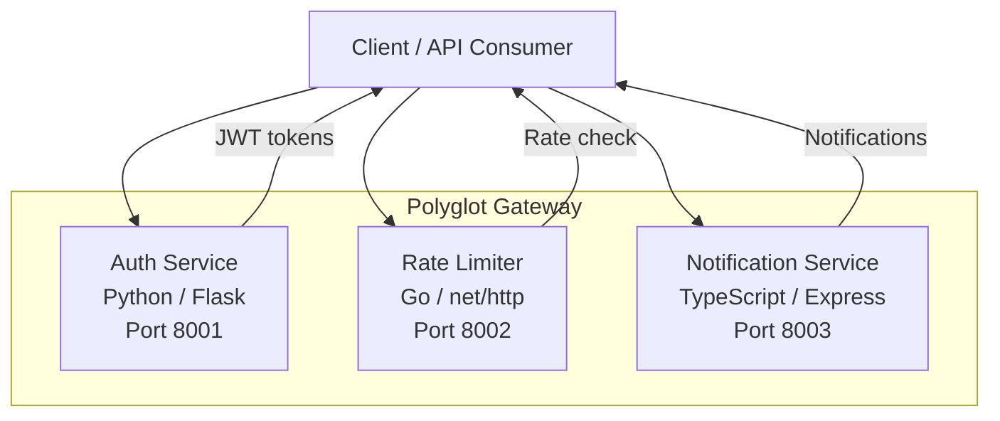

# Polyglot Gateway

A unified API gateway platform built with three microservices, each in a different language: **Python**, **Go**, and **TypeScript**. Designed for learning polyglot architectures and demonstrating how multiple services collaborate in a Docker Compose environment.

## Architecture



### Services

| Service | Language | Framework | Port | Purpose |
|---------|----------|-----------|------|---------|
| Auth Service | Python 3.12 | Flask | 8001 | JWT authentication, user registration & login |
| Rate Limiter | Go 1.22 | net/http | 8002 | Sliding window rate limiting & analytics |
| Notification Service | TypeScript 5 | Express | 8003 | Multi-channel notifications (email, SMS, webhook) |

## Quick Start

### Prerequisites

- Docker & Docker Compose
- Or for local development:
  - Python 3.12+
  - Go 1.22+
  - Node.js 22+

### Using Docker Compose

```bash
# Copy environment configuration
cp .env.example .env

# Start all services
make up

# Check health
curl http://localhost:8001/health
curl http://localhost:8002/health
curl http://localhost:8003/health

# Stop all services
make down
```

### Local Development

```bash
# Run all tests
make test

# Run all linters
make lint
```

## API Reference

### Auth Service (Port 8001)

#### `GET /health`
Health check endpoint.

```bash
curl http://localhost:8001/health
# {"status": "healthy", "service": "auth-service"}
```

#### `POST /register`
Register a new user.

```bash
curl -X POST http://localhost:8001/register \
  -H "Content-Type: application/json" \
  -d '{"username": "alice", "password": "secret123"}'
# {"message": "user registered successfully"}
```

#### `POST /login`
Authenticate and receive a JWT token.

```bash
curl -X POST http://localhost:8001/login \
  -H "Content-Type: application/json" \
  -d '{"username": "alice", "password": "secret123"}'
# {"token": "eyJ..."}
```

#### `POST /verify`
Verify a JWT token.

```bash
curl -X POST http://localhost:8001/verify \
  -H "Authorization: Bearer eyJ..."
# {"valid": true, "user": "alice"}
```

### Rate Limiter (Port 8002)

#### `GET /health`
Health check endpoint.

```bash
curl http://localhost:8002/health
# {"status": "healthy", "service": "rate-limiter"}
```

#### `POST /check`
Check and consume a rate limit token for a client.

```bash
curl -X POST http://localhost:8002/check \
  -H "Content-Type: application/json" \
  -d '{"client_id": "user-123"}'
# {"allowed": true, "remaining": 99, "limit": 100, "reset_ms": 60000}
```

#### `GET /stats`
Get rate limiter statistics.

```bash
curl http://localhost:8002/stats
# {"active_clients": 1, "limit": 100, "window_ms": 60000}
```

### Notification Service (Port 8003)

#### `GET /health`
Health check endpoint.

```bash
curl http://localhost:8003/health
# {"status": "healthy", "service": "notification-service"}
```

#### `POST /notify`
Send a notification (channels: `email`, `sms`, `webhook`).

```bash
curl -X POST http://localhost:8003/notify \
  -H "Content-Type: application/json" \
  -d '{"channel": "email", "recipient": "user@example.com", "subject": "Hello", "body": "Welcome!"}'
# {"id": "notif-1", "channel": "email", "recipient": "user@example.com", ...}
```

#### `GET /notifications`
List all sent notifications.

```bash
curl http://localhost:8003/notifications
# {"notifications": [...], "total": 1}
```

#### `GET /notifications/:id`
Get a specific notification by ID.

```bash
curl http://localhost:8003/notifications/notif-1
# {"id": "notif-1", "channel": "email", ...}
```

## Environment Variables

See [`.env.example`](.env.example) for all configuration options.

| Variable | Default | Description |
|----------|---------|-------------|
| `LOG_LEVEL` | `INFO` | Log level (DEBUG, INFO, WARN, ERROR) |
| `AUTH_SERVICE_PORT` | `8001` | Auth service port |
| `JWT_SECRET` | `dev-secret-key` | JWT signing secret |
| `TOKEN_EXPIRY_MINUTES` | `60` | JWT token expiry in minutes |
| `RATE_LIMITER_PORT` | `8002` | Rate limiter port |
| `RATE_LIMIT` | `100` | Max requests per window |
| `RATE_WINDOW_MS` | `60000` | Rate limit window in ms |
| `NOTIFICATION_SERVICE_PORT` | `8003` | Notification service port |

## Project Structure

```
polyglot-gateway/
├── docker-compose.yml
├── Makefile
├── .env.example
├── .gitignore
├── .github/
│   └── workflows/
│       └── ci.yml
├── README.md
└── services/
    ├── auth-service/          # Python / Flask
    │   ├── Dockerfile
    │   ├── app.py
    │   ├── test_app.py
    │   └── requirements.txt
    ├── rate-limiter/          # Go / net/http
    │   ├── Dockerfile
    │   ├── go.mod
    │   ├── main.go
    │   └── main_test.go
    └── notification-service/  # TypeScript / Express
        ├── Dockerfile
        ├── package.json
        ├── tsconfig.json
        ├── jest.config.js
        ├── .eslintrc.json
        └── src/
            ├── app.ts
            └── app.test.ts
```

## CI/CD

GitHub Actions runs on every push and pull request to `main`:

1. **test-python** - Lints with flake8, runs pytest
2. **test-go** - Runs go vet, runs go test
3. **test-typescript** - Lints with ESLint, runs Jest
4. **docker-build** - Builds all Docker images (after tests pass)

> **Note**: The `.github/workflows/ci.yml` file may need to be manually added after initial repository setup due to GitHub API limitations with the `.github/` directory.

## License

MIT
